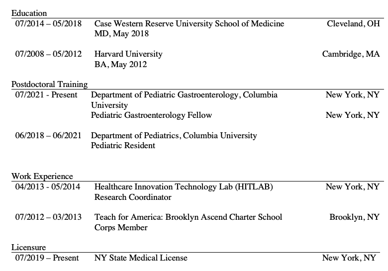
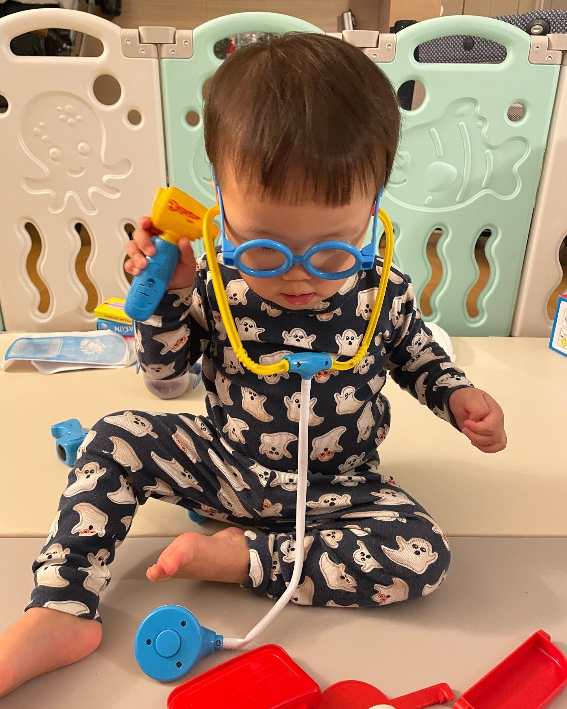

Welcome to Elise's website!

This is my first website that I am building with Data Sciences I class. Here is a little bit about myself and also create a dashboard on the restaurant inspections in NYC. 

Here is a snapshot of my resume with my education and work experience. 

I am currently a pediatric gastroenterology fellow at [Columbia](https://www.pediatrics.columbia.edu/education/fellowship-training/gastroenterology-hepatology-and-nutrition)

You can find me on [linkedin](https://www.linkedin.com/in/elise-kang-77964427/)

I also enjoy writing for [Buoy Health](https://www.buoyhealth.com/writers/elise-kang-md)

You can find me on [github](https://github.com/ek2794) as well.

Last but not least, I have an 18 month old son named Thomas.

Click [here](dashboard.html) if you are interested in learning more about NYC restaurant inspections!
